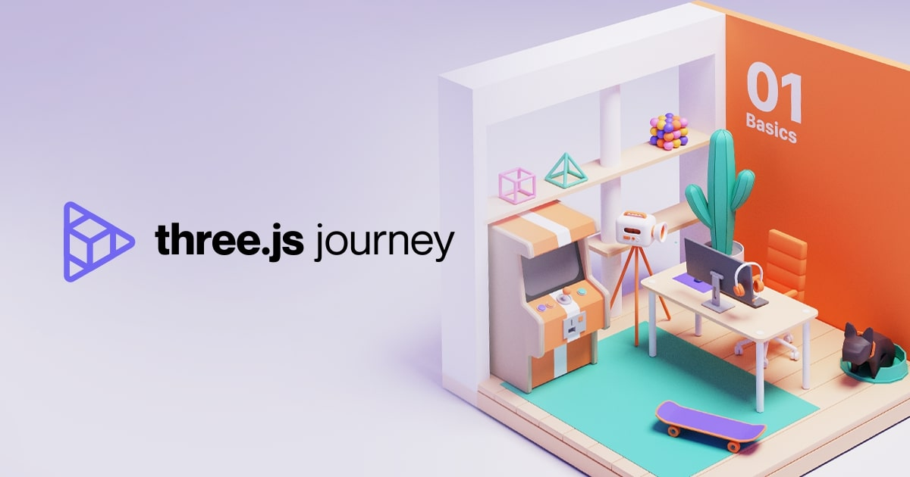

# Personal Archive

    Welcome to <strong>Three.js Journey</strong>.
     
    <a href="https://threejs-journey.com/">Three.js Journey - Bruno Simon</a>

### What is Three.js Journey?

[Three.js Journey](https://threejs-journey.com) is an online course created by [Bruno Simon](https://bruno-simon.com/), a creative developer based in France, best known for crafting engaging and innovative 3D web experiences. In this course, he teaches how to use [Three.js](https://threejs.org/) and [WebGL](https://get.webgl.org/) to build interactive 3D websites.

### What is this repository about?

> [!NOTE]  
> This repository documents my learning progress with **WebGL**, **Three.js**, **React Three Fiber (R3F)**, and **Shaders**. It's based on the Three.js Journey course, featuring improved source code that I've rewritten in **TypeScript** and incorporating both classic and modern techniques where applicable.
>
> This repository is intended as a personal reference for future use, but feel free to use it for educational purposes as well.

I completed the [Three.js Journey](https://threejs-journey.com) course in 2023. Since then, Three.js has undergone many changes and introduced several new features. The course itself has also been updated with new lessons on shaders and a subtitle feature. While it's an excellent course, it's taught using vanilla JavaScript to keep it beginner-friendly.

Since my job doesn’t involve Three.js and I haven’t had much hands-on experience with it, I’ve forgotten most of what I previously learned. I may have also missed some key concepts when I first took the course in 2023, especially with all the recent updates to Three.js. With that in mind, I’ve decided to revisit the Three.js Journey course to re-learn and strengthen my understanding.

As I re-learn Three.js, I'm documenting my entire learning journey, capturing everything I gain from the course, along with insights shared by the community on the **Discord** server. I'm also enhancing the original lesson's source code by rewriting it in **TypeScript**, applying best practices, and incorporating both classic and modern techniques where applicable.
